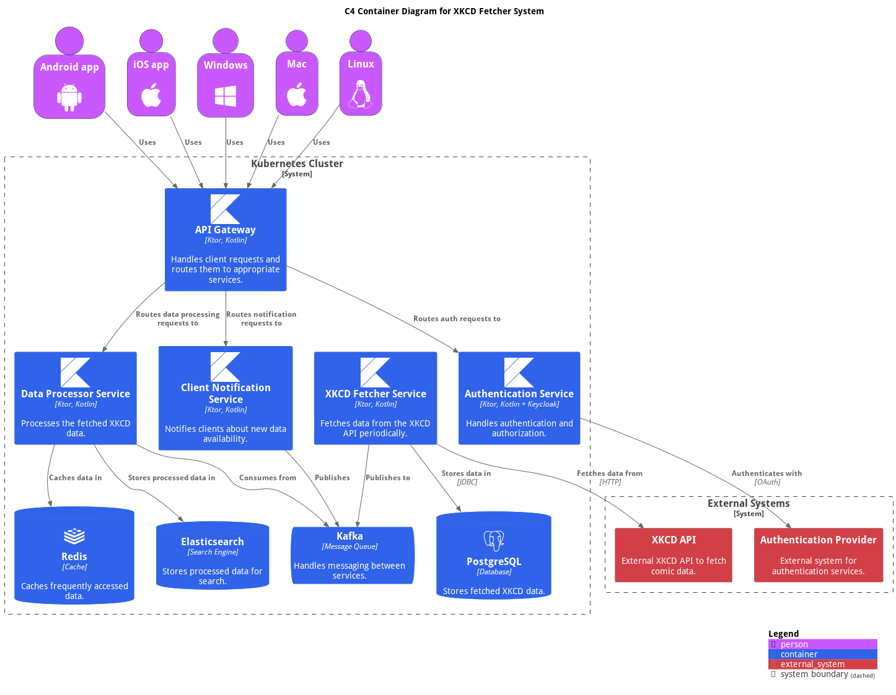

# XKCD Data Hub


Welcome to the XKCD Data Hub! 👋

Imagine fetching your favorite XKCD comics, streaming them to a service that
neatly organizes everything using some cool engineering tricks, and then serving
it all up to your eager fingertips. That's what this project is all about! 🎉

## Features

- Fetch the latest XKCD comic information.
- Stream data to a projection service using CQRS and the outbox pattern.
- Serve data from an Event Store to the client.
- Easy setup and deployment using Docker Compose.

## Table of Contents

1. [Setup and Installation](#setup-and-installation)
2. [Architecture](#architecture)

## Setup and Installation

### Prerequisites

- Docker and Docker Compose
- JDK 21 or higher
- Kotlin 2.0 or higher
- Gradle build system

### Steps to Run the Project Locally

1. **Clone the Repository:**

   ```sh
   $ git clone https://github.com/yonatankarp/xkcd-data-hub.git
   $ cd xkcd-data-hub
   ```
2. **Build the Project:**

   ```sh
   ./gradlew build
   ```
3. **Run the Infrastructure using Docker Compose:**

   ```sh
   docker-compose up -d
   ```

   This will start all the necessary infrastructure including databases,
   message brokers, and any other related components.

### Architecture

The project contains multiple submodules. Here's a brief overview of each:
* [Fetcher](./fetcher/README) - Built using ktor, collects information about
XKCD comics, and streams it to the projection service.
* [Projection](./projection/README) - stores and serves XKCD comic data to
clients.
* [App](./app/README) - provides a user interface to interact with the XKCD
data via API.

### Target Architecture

The following diagram describes the end goal of this repository:



